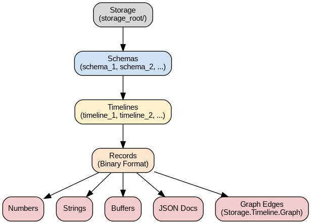

# Storage.Timeline ~~NoSQL~~ database white-paper
Document version 1.1 by [Andrew](mailto:andrew@fucken.me), 2010 - 2025 (c).

## Introduction
**Storage.Timeline** is an OpenSource specialized database for storing time series data from the perspective of:
- storage portability;
- processing performance;
- ability to easily extend the storage stack.

The storage engine has implementations in:
- [Node.js (stable, actively used)](https://github.com/vitche/nodejs-storage-timeline);
- .NET (stable, not used).

The server API has implementations in:
- Node.js, Express.js (API v1.x);
- Node.js in-memory implementation (API v2.x).

The API client library has implementations in:
- [Node.js](https://github.com/vitche/nodejs-storage-timeline-client);
- [Python](https://github.com/vitche/python-storage-timeline-client);
- [BASH](https://github.com/vitche/shell-storage-timeline-client);
- R.

## Road-map
**Year 2010.** 
**Storage.Timeline** database development was started in 2010. 
At the time being there were no databases providing similar functionality. 
The task of storing time series data was solved using other types of databases.
Several brainstorm sessions were performed with Vitche Research Team teammates resulting in an architecture describing many 
data processing principles in general and deriving the **Storage.Timeline** architecture from these principles.

**Apr 10, 2015.** Abandoned the **C# Storage.Timeline engine** implementation for the sake of **Node.js Storage.Timeline engine** implementation.

**August, 2022.**
The **in-memory Node.js Storage.Timeline instance** was constructed and deployed to Google Cloud Platform. 
Started work on replication implementation.

## APIs and protocols

### Storage.Timeline Express.js HTTP API (API v1.x)
This API version was used from 2015 till 2022.
It is still supported, but not recommended for new projects.

### Storage.Timeline HTTP REST API (API v2.x)
**Storage.Timeline HTTP REST API v2.x** is suitable for most implementations not requiring high performance and high data volumes.

REST APIs are:
- slow;
- easy to integrate due to the REST spread over the years.

You should avoid integrating the REST API for solutions demanding more than **1000000 (1M) records of data transfer at a time**.

### `Storage.Timeline` layers

Explanation of the Diagram:

1. “Storage (storage_root/)” is the root directory where your entire database is located.
2. “Schemas” are subdirectories (schema_1, schema_2, …) that group related timelines.
3. Each “Timeline” is typically a single file in the schema directory, storing time-series records.
4. Within each timeline file, individual “Records” are stored in the described binary format (`size` → `timestamp` → `value`).
5. Those records can encode:
   - Numeric values (64-bit floats);
   - Strings (UTF-8);
   - Buffers (arbitrary binary data);
   - JSON Documents (encoded as strings);
   - Graph data (serialized as JSON edges of the form `s`, `t`, `w`).

This layered architecture makes it straightforward to organize data by schema, then timeline, and finally store each record according to its type (numbers, strings, buffers, JSON documents, or graph edges).

### `Storage.Timeline` data format
[format.md](./format.md)

### `Storage.Timeline.Graph` data format
[graph.md](./graph.md)

## Terminology

**~~NoSQL~~**. 
The term "NoSQL" is avoided due to the misleading nature of this classification.
The topic is well covered in [NoSQL Distilled by Pramod J. Sadalage and Martin Fowler](https://martinfowler.com/books/nosql.html).
Initially, the **Storage.Timeline database** was called the **Storage.Timeline NoSQL database**.
But now we think that it was not more than a tribute to the marketing trend.

## License
[GNU GENERAL PUBLIC LICENSE](https://github.com/vitche/documentation-storage-timeline/blob/main/LICENSE)

